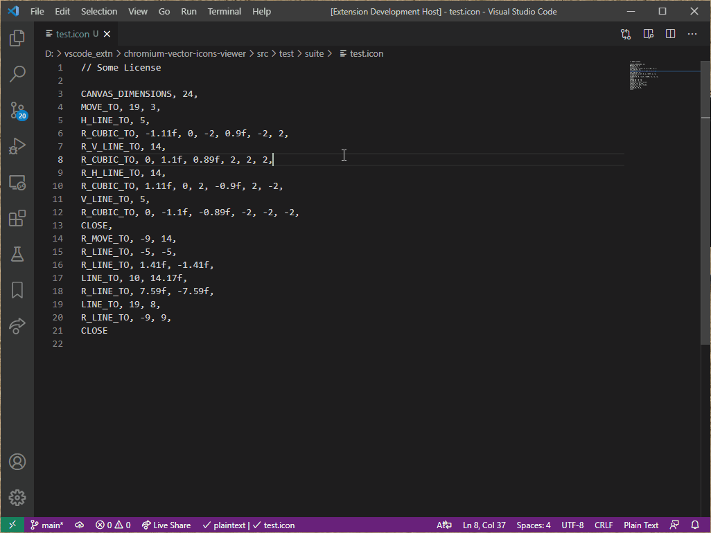

# Chromium Vector Icons Previewer

This VS Code extension helps you to preview vector icons used by [Chromium](https://source.chromium.org/chromium/chromium/src/+/master:components/vector_icons/).

## Features

Previews the vector icons with `*.icon` extension in the side panel.

## Requirements

The file extension should be `.icon` to preview using this extension.

## Release Notes

### 1.0.0

Initial release of Vector Icon Previewer.

-----------------------------------------------------------------------------------------------------------
